В проекте "Работа мечты" представлена биржа работы. 
После регистрации и авторизации пользователя можно получить доступ к просмотру вакансий и кандидатов.
Главная страница
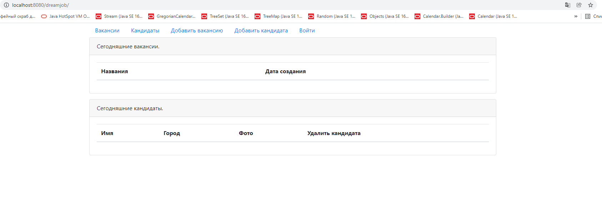
Для дальнейшего использования сайта необходимо авторизироваться
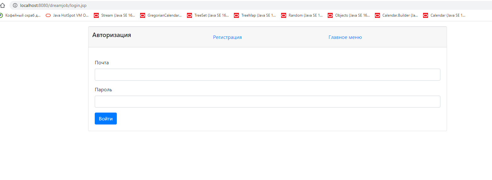
После ввода данных происходит проверка. Если пользователь не существует в базе либо пароль существуещего пользователя
введен неверно, высвечивается предупреждение
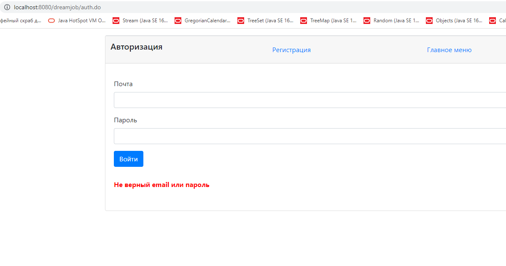
Для незарегистрированных пользователей доступна форма регистрации
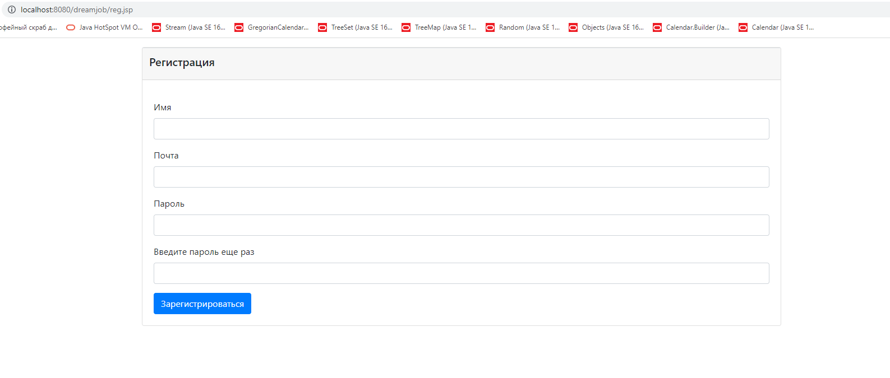
Если пользователь забыл ввести одно из полей как на странице авторизации, так и на странице регистрации,
появляется окошко с напоминанием, какое поле необходимо заполнить
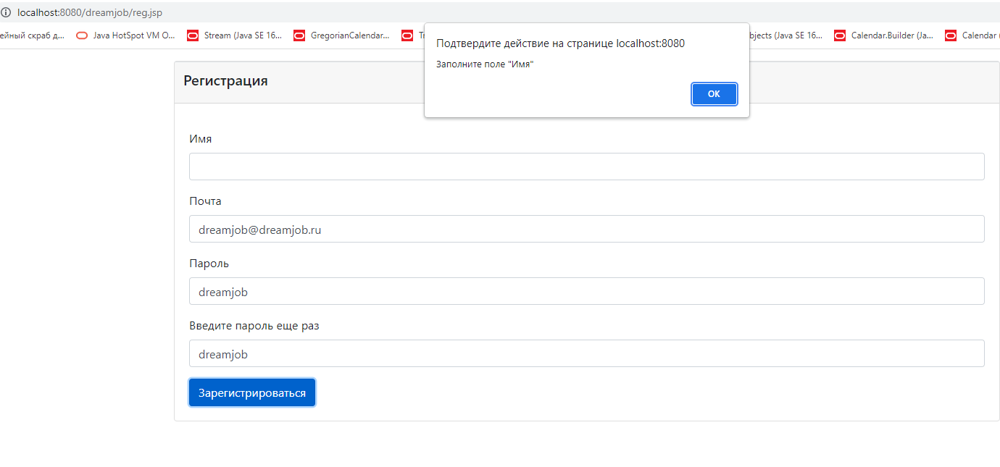
При регистрации после ввода данных также происходит проверка. Если пользователь с данным e-mail уже существует либо
введенные пароли не совпадают, высвечивается соответствующее предупреждение
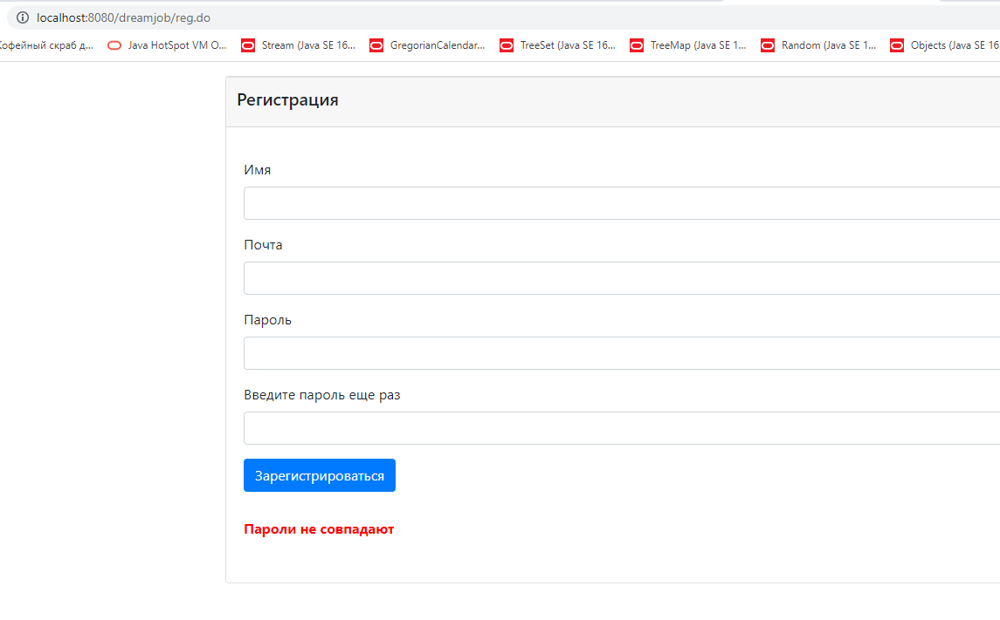
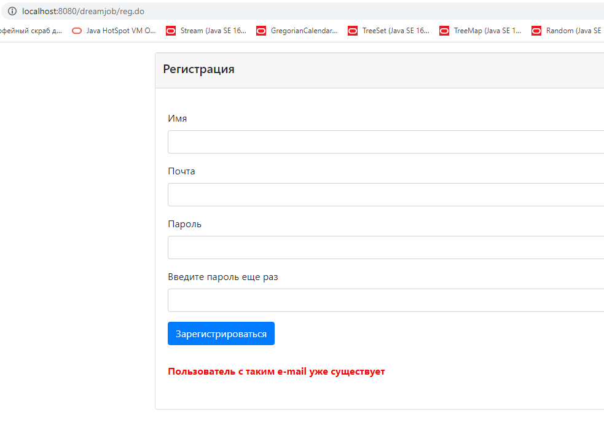
После авторизации пользователь получает доступ к сайту. на главной странице можно увидеть список вакансий и список кандидатов за сегодняшний день
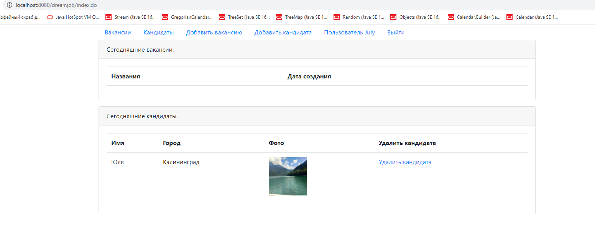
Получить список вакансий за все время можно, нажав на "Вакансии"
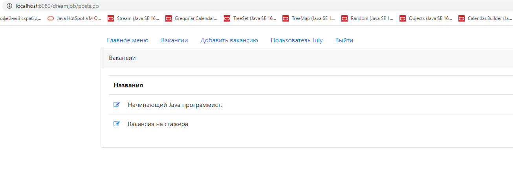
Получить список кандидатов за все время можно, нажав на главной странице на "Кандидаты"
На сайте можно добавить новую вакансию или нового кандидата
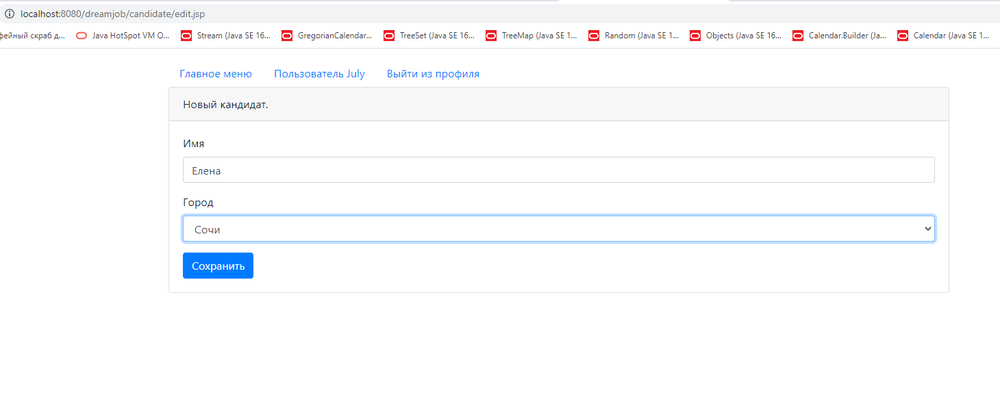
После сохранения нового кандидата, переходим на страницу со списком всех кандидатов. Самым последним в таблице видим только что созданного кандидата 
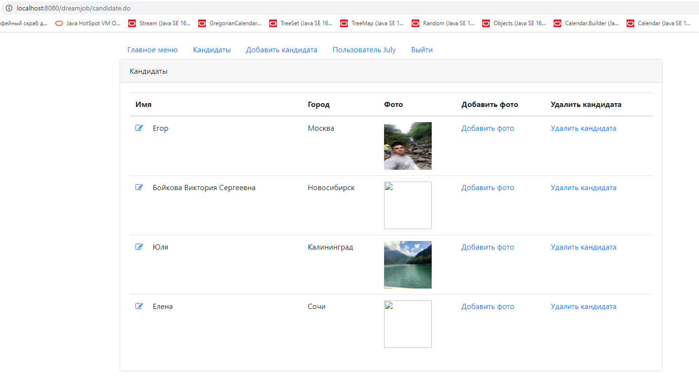
Кандидату можно присвоить фото, нажав на "Добавить фото"
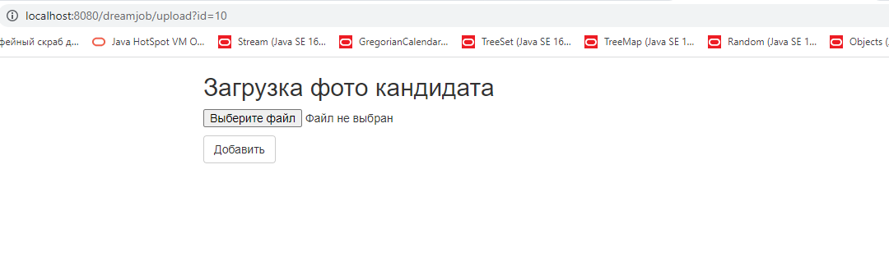
После этого видим, как нашему новому кандидату мы загрузили фото
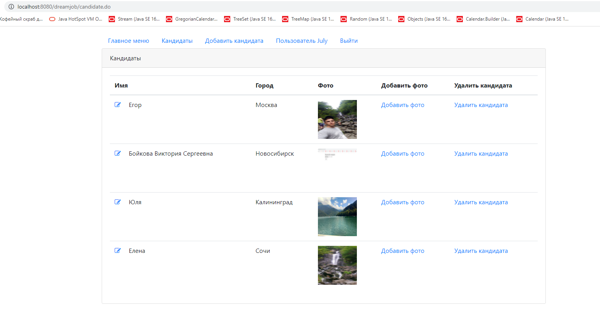
Кандидата можно удалить. Для этого необходимо нажать на "Удалить кандидата". Видим, что вместо 4 кандидатов осталось только 3
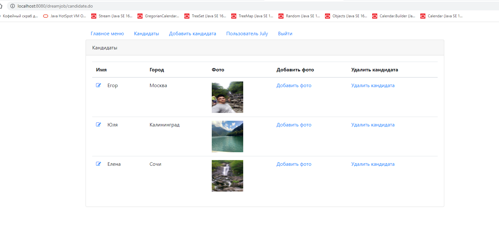